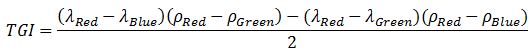
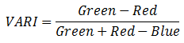
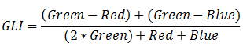
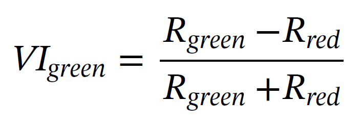
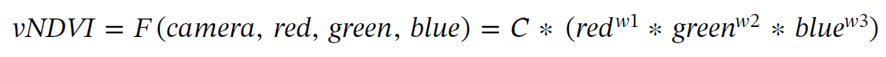

# RGB2vINDEX

RGB image to vINDEX, vINDEX = {TGI, GLI, VARY, VIgreen, vNDVI}

## Installation

```
conda create -n vINDEX python=3.9
condas activate vINDEX
pip install opencv-python
```

## Equation of vINDEX

#### TGI (Triangular Greeness Index)
------------------------------------


#### VARI (Visible Atmospheric Resistant Index)
------------------------------------


#### GLI(Green Leaf Index)
------------------------------------


#### VIgreen(Visible Atmospherically Resistant Indices Green)
------------------------------------


#### vNDVI(visible NDVI)
------------------------------------


## Reference

- https://www.l3harrisgeospatial.com/docs/broadbandgreenness.html
- https://github.com/OpenDroneMap/WebODM
- https://www.sciencedirect.com/science/article/pii/S016816991932383X